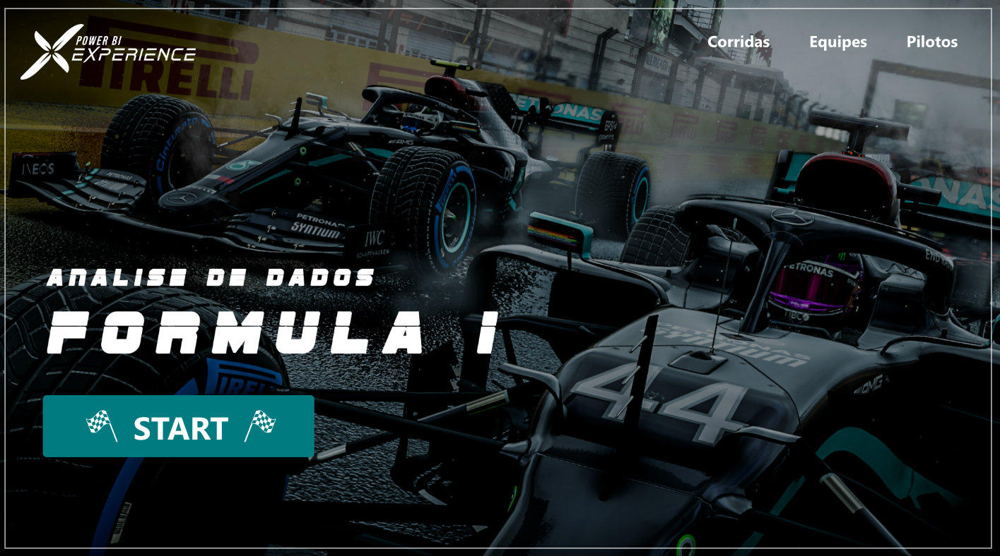
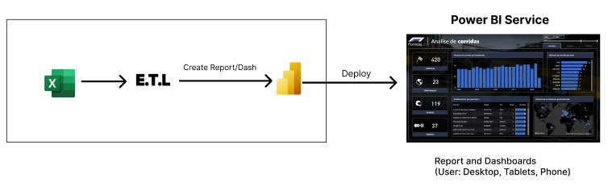

# Objetivo

Este dashboard foi projetado para oferecer uma análise abrangente das corridas, equipes e pilotos da Fórmula 1. Vamos ter as abas “Corridas”, “Equipes” e “Pilotos”  ambas permitem uma comparação direta entre os elementos-chave, enquanto a interatividade aprimora a experiência do usuário.

# Principais Análises

### **Corridas**

- Pilotos
- Equipes
- Temporadas
- Total de Corridas
- Mapa para melhorar a visualização do local das corridas
- Gráficos e tabelas destacam localização, total de corridas e detalhamento do Grand Prix.

### **Equipes**

- Pilotos
- Equipes
- Temporadas
- Total de Corridas
- Gráficos e tabelas destacam pontuação, vitórias e podiums por equipe

### **Pilotos**

- Pilotos
- Equipes
- Temporadas
- Total de Corridas
- Gráficos e tabelas destacam pontuação, vitórias e podiums por piloto

# Arquitetura

# Tecnologias

- Excel
- Power BI (Power Query, DAX)

# Agradecimentos

Quero deixar meus agradecimentos à [Xperiun](https://www.linkedin.com/company/xperiun/) por estar sempre proporcionando esse aprendizado contínuo em suas imersões!

---
---
---
---
---

# Objective

This dashboard was designed to offer a comprehensive analysis of Formula 1 races, teams, and drivers. We have tabs for "Races," "Teams," and "Drivers," all allowing a direct comparison between key elements, while interactivity enhances the user experience.

# Key Analyses

### **Races**

- Drivers
- Teams
- Seasons
- Total Races
- Map to enhance race location visualization
- Graphs and tables highlight location, total races, and Grand Prix details.

### **Teams**

- Drivers
- Teams
- Seasons
- Total Races
- Graphs and tables highlight scores, wins, and podiums per team.

### **Drivers**

- Drivers
- Teams
- Seasons
- Total Races
- Graphs and tables highlight scores, wins, and podiums per driver.

# Architecture

# Technologies

- Excel
- Power BI (Power Query, DAX)

# Acknowledgments

I want to express my gratitude to [Xperiun](https://www.linkedin.com/company/xperiun/) for consistently providing continuous learning through their immersions!
