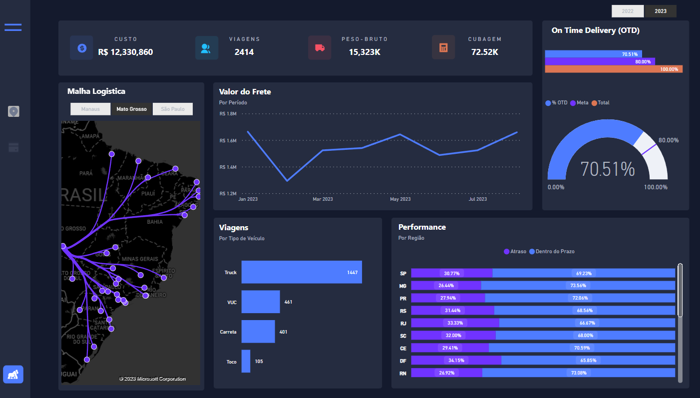
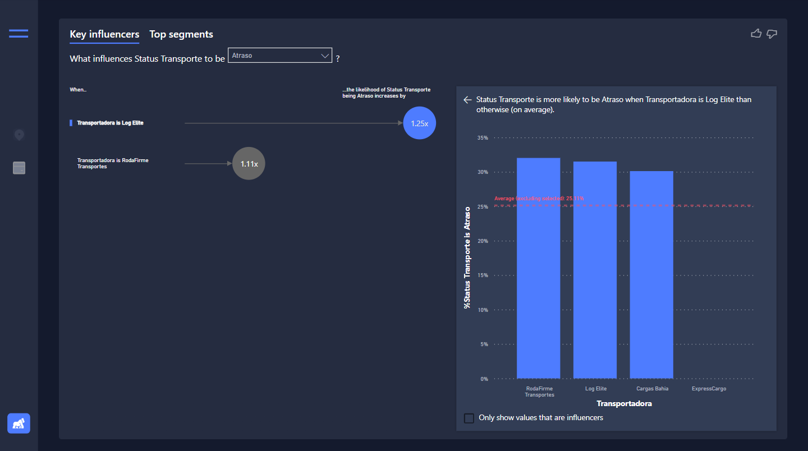
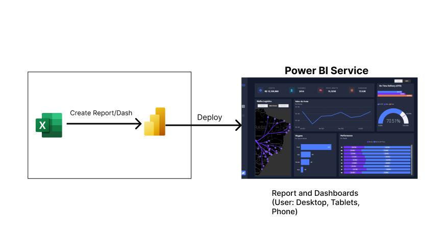

# Objetivo
O objetivo deste dashboard é analisar as principais métricas relacionadas à logística da empresa, proporcionando um insight estratégico para a organização. O foco também foi incorporar a interatividade entre os painéis, potencializando a análise com maior profundidade e informação.

# Principais Análises
Foram adicionadas duas abas, uma traz uma visão geral para análise da logística. Já a outra tem o objetivo de trazer um storytelling com o Key Influencers do Power BI sobre as principais transportadoras que realizam as entregas, analisando qual impacta mais nos atrasos e nas entregas dentro do prazo.

## Aba Menu

- Custo
- Viagens
- Peso Bruto
- Cubagem
- On Time Delivery x Meta
- Malha Logística
- Valor do Frete 
- Viagens por Tipo de Veículos
- Performance por Região

## Aba Influenciadores Chave
- Análise de Principais Transportadoras que Realizam as Entregas, o objetivo é entender qual impacta mais nas entregas e nos atrasos.

# Arquitetura

# Tecnologias

- Excel
- Figma
- Power BI (Power Query, DAX)

---
---
---
---
---

# Objective

The aim of this dashboard is to analyze key metrics related to the logistics of the company, providing a strategic insight for the organization. The focus was also on incorporating interactivity between panels, enhancing the analysis with greater depth and information.

# Key Analyses
Two tabs have been added, one providing an overview for logistics analysis, and the other aiming to present a storytelling approach using Power BI's Key Influencers feature. This storytelling focuses on the primary carriers responsible for deliveries, analyzing their impact on delays and on-time deliveries.

## Menu Tab

- Cost
- Trips
- Gross Weight
- Cubic Volume
- On-Time Delivery vs. Target
- Logistics Network
- Freight Value
- Trips by Vehicle Type
- Performance by Region

## Key Influencers Tab
- Analysis of Primary Carriers for Deliveries, aiming to understand their impact on deliveries and delays.

# Architecture

# Technologies

- Excel
- Figma
- Power BI (Power Query, DAX)