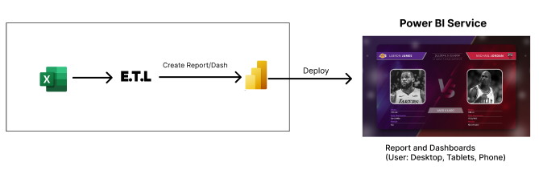

# Objetivo

O propósito deste painel é analisar as principais métricas dos maiores jogadores da NBA, incluindo uma aba "Lado a Lado", a fim de proporcionar uma visão comparativa entre eles. O foco também foi adicionar interatividade entre os painéis, tornando a análise mais robusta e bonita.

# Principais Análises

## Aba Lebron

- Porcentagem de cestas
    - 03 pontos;
    - Cestas;
    - Arremessos Livres.
- Métricas das Partidas
- Análise das Temporadas

## Aba Jordan

- Porcentagem de cestas
    - 03 pontos;
    - Cestas;
    - Arremessos Livres.
- Métricas das Partidas
- Análise das Temporadas

## Lado a Lado

- Comparativo entre as métricas citadas acima
- Filtro para análise de temporadas
- Filtro para análise de Métricas

# Arquitetura

# Tecnologias

- Excel
- Power BI (Power Query, DAX)

# Agradecimentos

Quero deixar meu agradecimento à [Xperiun](https://www.linkedin.com/company/xperiun/) por estar sempre proporcionando esse aprendizado contínuo em suas imersões!
