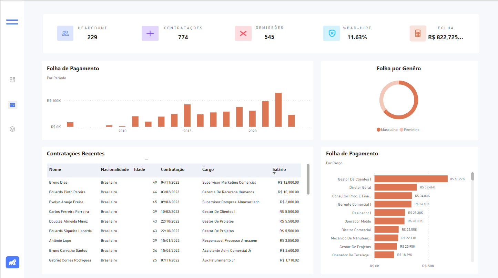
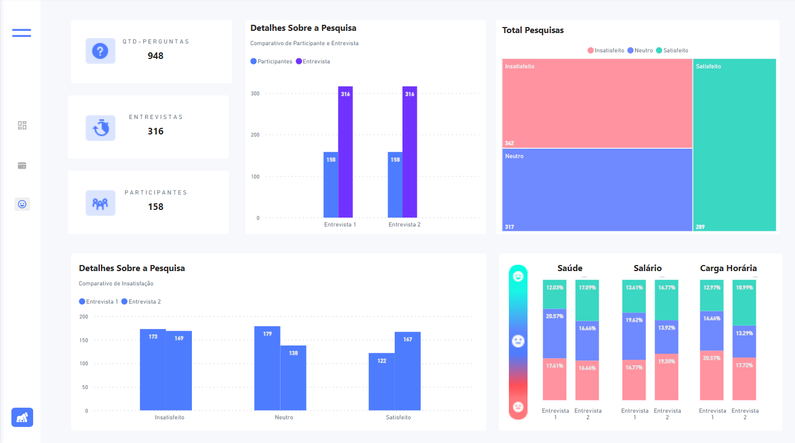
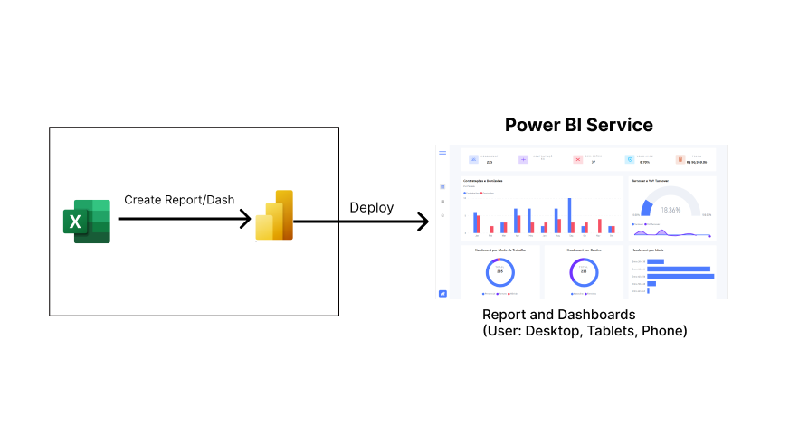

# Objetivo
O objetivo deste painel é analisar as principais métricas dos colaboradores da empresa, a fim de proporcionar uma visão estratégica para a empresa. O foco também foi adicionar interatividade entre os painéis, tornando a análise mais robusta e informativa.

# Principais Análises
Três abas foram criadas, cada uma com um enfoque específico. A primeira oferece uma visão geral da empresa, enquanto a segunda se dedica à análise de valores e folhas de pagamento. A terceira aba se destina à avaliação das pesquisas de satisfação realizadas com os atuais funcionários.

## Aba Menu
- Headcount
- Contratações
- Demissões
- % Má Contratação
- Folha
- Contratações e Demissões por Período
- Turnover e Turnover YoY
- Headcount por Genêro
- Headcount por Modo de Trabalho
- Headcount por Idade

## Aba Folha
- Folha de Pagamento por Período
- Folha por Genêro
- Tabela - Contratações Recentes
- Folha de Pagamento por Cargo

## Aba Pesquisa de Satisfação
- Quantidade de Perguntas
- Entrevistas
- Participantes
- Detalhes sobre Pesquisa (Comparativo)
- Total de Pesquisas
- Gráfico Individual para cada Tópico Abordado na Entrevista

# Arquitetura

# Tecnologias

- Excel
- Figma
- Power BI (Power Query, DAX)

---
---
---
---
---

# Objective

The purpose of this dashboard is to analyze key metrics of company employees, providing a strategic overview for the organization. The focus was also on adding interactivity between panels, making the analysis more robust and informative.

# Key Analyses
Three tabs have been created, each with a specific focus. The first provides an overview of the company, while the second is dedicated to the analysis of values and payroll. The third tab is intended for evaluating satisfaction surveys conducted with current employees.

## Menu Tab
- Headcount
- Hires
- Terminations
- % New Hires
- Payroll
- Hires and Terminations by Period
- Turnover and Turnover YoY
- Headcount by Gender
- Headcount by Work Mode
- Headcount by Age

## Payroll Tab
- Payroll by Period
- Payroll by Gender
- Table - Recent Hires
- Payroll by Position

## Satisfaction Survey Tab
- Number of Questions
- Interviews
- Participants
- Survey Details (Comparative)
- Total Surveys
- Individual Graph for Each Topic Addressed in the Interview

# Architecture

# Technologies

- Excel
- Figma
- Power BI (Power Query, DAX)