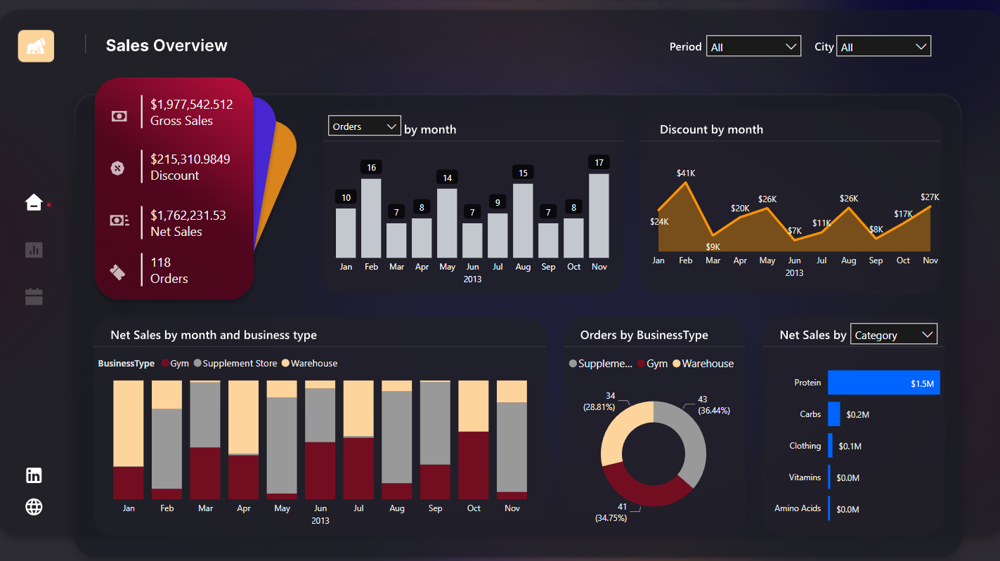
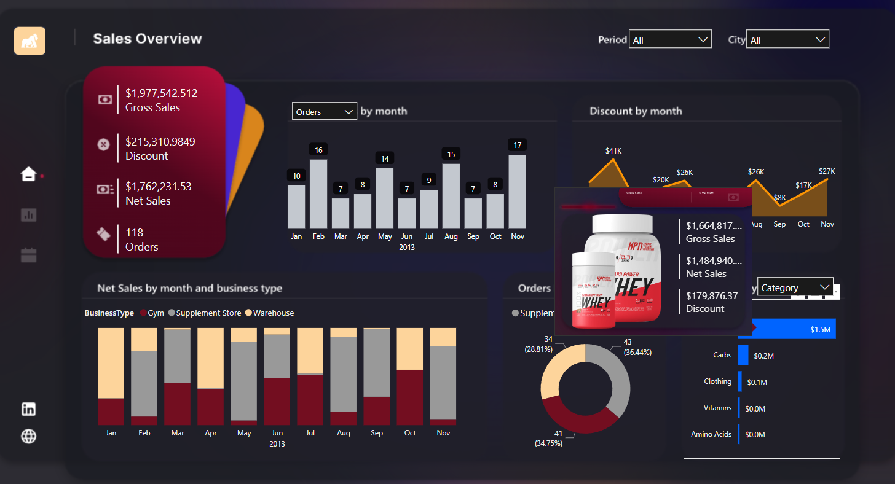
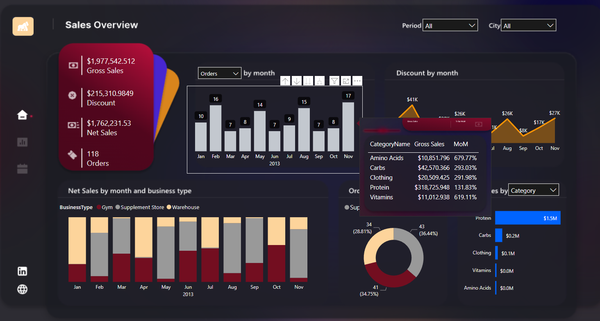
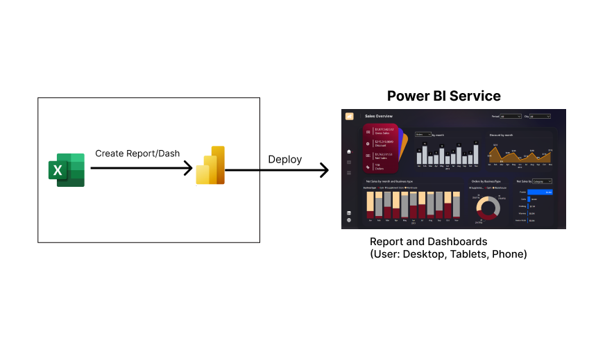

# Objetivo
O objetivo deste painel é analisar as principais métricas de vendas de uma empresa do ramo fitness, a fim de proporcionar uma visão estratégica para a empresa. O foco também foi adicionar interatividade entre os painéis, tornando a análise mais robusta e informativa.

# Principais Análises

## Aba Geral
- Faturamento Bruto (Gross Sales)
- Desconto (Discount)
- Vendas Líquidas (Net Sales)
- Pedidos (Orders)
- Pedidos/Vendas Líquidas/Faturamento Bruto por Mês (Order/Net Sales/Gross Sales by Month)
- Desconto por Mês (Discount by Month)
- Vendas Líquidas por Mês e Tipo de Negócio (Net Sales by Month and Business Type)
- Pedidos por Tipo de Negócio (Orders by Business Type)
- Vendas Líquidas por Categoria/Estado/Sub-Categoria (Net Sales by Category/State/Subcategory)

## Tooltips
- O **Tooltip Categoria** mostra as informações relacionados ao produto em questão, quando passar o mouse em cima do produto que deseja visualizar, aparecerá o tooltip com: Imagem do Produto, Faturamento Bruto, Faturamento Líquido e Descontos.

- O **Tooltip Tabular** mostra as informações relacionados tipo de análise que você deseja fazer, como esse gráfico vem com um filtro dinâmico, você pode analisar os valores: Categoria do Produto, Faturamento bruto e Porcentagem MoM dos meses e valor do filtro em questão.

# Arquitetura

# Tecnologias

- Excel
- Figma
- Power BI (Power Query, DAX)

# Agradecimentos
Quero deixar meu agradecimento à [Xperiun](https://www.linkedin.com/company/xperiun/) por estar sempre proporcionando esse aprendizado contínuo em suas imersões!

---
---
---
---
---

# Objective
The aim of this dashboard is to analyze key sales metrics for a fitness industry company, providing a strategic overview for the business. The focus was also on adding interactivity between panels, making the analysis more robust and informative.

# Key Analyses

## General Tab
- Gross Sales
- Discount
- Net Sales
- Orders
- Orders/Net Sales/Gross Sales by Month
- Discount by Month
- Net Sales by Month and Business Type
- Orders by Business Type
- Net Sales by Category/State/Subcategory

## Tooltips
- The **Category Tooltip** displays information related to the selected product. When hovering over a specific product, the tooltip shows the Product Image, Gross Sales, Net Sales, and Discounts.

- The **Tabular Tooltip** displays information based on the chosen analysis type. As this chart comes with a dynamic filter, you can analyze values such as Product Category, Gross Sales, MoM Percentage for months, and the selected filter value.

# Architecture

# Technologies

- Excel
- Figma
- Power BI (Power Query, DAX)

# Acknowledgments
I want to express my gratitude to [Xperiun](https://www.linkedin.com/company/xperiun/) for consistently providing continuous learning through their immersions!